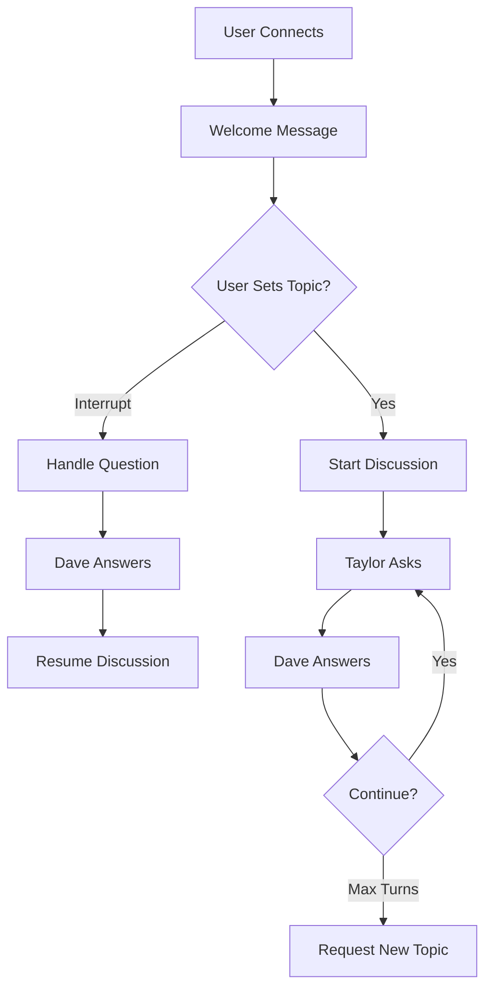

# Podcast Backend Guide

## Overview
The SignTutor podcast system is an AI-powered educational podcast featuring multi-agent conversations about sign language and Deaf culture. This guide explains the architecture, setup, and usage of the podcast backend.

## System Architecture

### Components
1. **Podcast Manager** (`podcast/podcast_manager.py`) - Orchestrates conversation flow
2. **State Machine** (`podcast/services/state_machine.py`) - Manages conversation states
3. **AI Agents** (`podcast/agents/`) - Rick/Dave (Expert), Morty/Taylor (Host), Summer/Pat (Coordinator)
4. **WebSocket Handler** (`podcast/websocket/handler.py`) - Real-time communication with frontend

### AI Models
- **Cloud Model**: OpenAI GPT-4o-mini (default, accurate, handles pop culture)
- **Local Model**: Qwen3-4B fine-tuned on ASL/Deaf culture (faster, private, but limited scope)

## Setup Instructions

### 1. Install Dependencies
```bash
pip install -r requirements.txt
```

### 2. Configure API Keys
Create a `.env` file or set environment variables:
```bash
OPENAI_API_KEY=your_key_here
GOOGLE_TTS_API_KEY=your_google_key  # Optional
ELEVENLABS_API_KEY=your_elevenlabs_key  # Optional
```

### 3. (Optional) Setup Local Model
If you want to use the local Qwen3-4B model:

1. **Train/Download Model**:
   ```bash
   # If training from scratch
   python train_qwen3.py --output_dir ./qwen3_finetuned
   
   # Or download pre-trained checkpoint
   # Place in: ./qwen3_finetuned/final/
   ```

2. **Verify Model Structure**:
   ```
   qwen3_finetuned/final/
   ├── adapter_config.json
   ├── adapter_model.safetensors
   └── README.md
   ```

3. **Pre-load on Startup**:
   The model auto-loads in `app.py` if available:
   ```python
   # app.py handles this automatically
   preload_local_model(
       model_path="qwen3_finetuned/final",
       device="cuda"  # or "cpu" or "mps"
   )
   ```

### 4. Start Backend
```bash
./start_app.sh
# Or manually:
python app.py
```

Server runs on `http://localhost:8000`

## Using the Podcast System

### Frontend Integration
Connect via WebSocket: `ws://localhost:8000/ws/podcast`

**Message Types**:
```javascript
// Set AI model preference
ws.send(JSON.stringify({
  type: 'set_model',
  use_local: true  // or false for cloud
}))

// Start podcast with topic
ws.send(JSON.stringify({
  type: 'start_podcast',
  topic: 'Fingerspelling in ASL'
}))

// Interrupt with question
ws.send(JSON.stringify({
  type: 'interrupt',
  message: 'How do you sign numbers?'
}))
```

### Conversation Flow



## Model Selection: Cloud vs Local

### Cloud Model (GPT-4o-mini)
✅ **Pros**:
- Highly accurate
- Handles pop culture references (e.g., "Mamba out" = Kobe Bryant)
- Broad world knowledge
- Fewer hallucinations

❌ **Cons**:
- Requires internet & API key
- Costs money per token
- Privacy concerns (data sent to OpenAI)

### Local Model (Qwen3-4B)
✅ **Pros**:
- Free after initial setup
- Private (runs on your hardware)
- Fast inference on GPU
- Fine-tuned specifically for ASL topics

❌ **Cons**:
- Limited to ASL/Deaf culture knowledge
- May miss pop culture connections
- Can hallucinate personal stories
- Requires 4GB+ VRAM

**Recommendation**: Use **cloud for general users**, **local for privacy/offline demos**.

## Troubleshooting

### Issue: "Local model not found"
```bash
# Check model path
ls qwen3_finetuned/final/
# Should show: adapter_config.json, adapter_model.safetensors

# If missing, train or download model first
```

### Issue: "Conversation stops after one turn"
**Symptoms**: Dave speaks, then silence.

**Causes & Fixes**:
1. **No topic set** → Use "Start Podcast" button, not just interrupt
2. **State machine stuck** → Restart backend (`Ctrl+C` then `./start_app.sh`)
3. **Local model hallucinating** → Switch to cloud model temporarily

### Issue: "Model hallucinating fake stories"
**Example**: "My cousin who's Deaf..." (when model has no cousin)

**Fixes**:
1. **Already applied**: Anti-hallucination constraints in `base.py`
2. **Lower temperature**: Edit `podcast/agents/base.py`:
   ```python
   temperature=0.5  # Down from 0.7
   ```
3. **Use cloud model** for important conversations

### Issue: "WebSocket disconnects frequently"
Check timeout settings in `app.py`:
```python
# Increase if needed
await asyncio.wait_for(response, timeout=60.0)
```

## Architecture Deep Dive

### State Machine States
- `WELCOME` - Initial greeting
- `DISCUSSING` - Active back-and-forth
- `MORTY_TURN` / `RICK_TURN` - Specific speaker turns
- `USER_INTERRUPT` - Handling user questions
- `NEW_TOPIC` - After max turns (default: 10 per topic)

### Key Files
```
podcast/
├── podcast_manager.py       # Main orchestration
├── agents/
│   ├── base.py             # BaseAgent (handles cloud/local generation)
│   ├── rick.py             # Dave/Rick (Expert)
│   ├── morty.py            # Taylor/Morty (Host)
│   └── summer.py           # Pat/Summer (Coordinator)
├── services/
│   └── state_machine.py    # PodcastStateMachine
└── websocket/
    └── handler.py          # WebSocket message routing
```

### Conversation Mechanics

**Cloud Model Flow**:
```python
# In base.py -> _generate_response()
messages = self._build_messages(...)  # Full chat history
response = await openai.chat.completions.create(
    model="gpt-4o-mini",
    messages=messages
)
```

**Local Model Flow**:
```python
# In base.py -> _generate_local_response()
user_prompt = f"""You are having a podcast conversation with {co_host} about {topic}.

Previous conversation:
{history}

Now it's your turn to speak. Ask {co_host} a follow-up question."""

response = local_generate(
    model=qwen3_model,
    user_prompt=user_prompt,
    stop_strings=["Dave:", "Taylor:", ...]  # Prevent cross-talk
)

# Post-processing: Add conversational hook if missing
if '?' not in response:
    response += f" What do you think, {co_host}?"
```

## Performance Optimization

### GPU Memory Management
```python
# In app.py
quantization_config = BitsAndBytesConfig(
    load_in_4bit=True,  # 4-bit quantization saves VRAM
    bnb_4bit_compute_dtype=torch.float16
)
```

### Conversation Turn Limits
Edit `podcast/services/state_machine.py`:
```python
max_turns_per_topic: int = 10  # Increase for longer discussions
```

### Response Time
- Cloud: ~2-5 seconds (network + API)
- Local: ~1-3 seconds (GPU inference)

## Advanced Configuration

### Custom Agent Personalities
Edit `podcast/agents/rick.py`, `morty.py`, etc.:
```python
professional_system_prompt = """You are Dave, a warm expert on ASL.
[Customize personality here]
"""
```

### TTS Integration
Configured in `config.py`:
```python
tts_config = {
    "provider": "google",  # or "elevenlabs" or "browser"
    "rick_voice": "en-US-Neural2-D",
    "morty_voice": "en-US-Neural2-A"
}
```

## Contributing

When modifying the podcast system:
1. Test with **both cloud and local models**
2. Verify conversation continues past first turn
3. Check for hallucinations in local model
4. Update this guide if adding features

## License & Credits
- Qwen3-4B: Alibaba Cloud
- Fine-tuning data: Custom ASL/Deaf culture Q&A dataset
- Architecture: SignTutor educational platform
