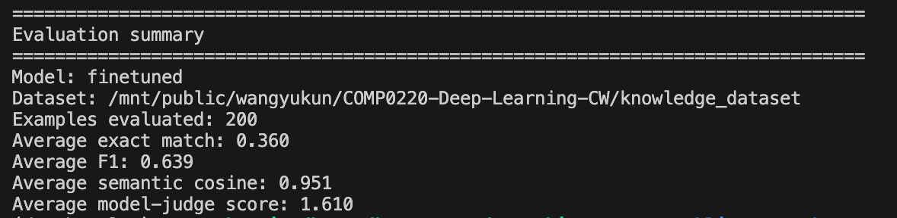

# Model Description

This project uses two custom models (a 2‑stage finetuned LLM and an LSTM baseline) plus several off‑the‑shelf components.

---

## 1. Finetuned Qwen3 Dialogue & QA Model (2‑Stage)

### Objective

- **Task**: Dialogue generation and question answering about Deaf culture, ASL, and sign language.
- **Role**: Core tutor/podcast brain (Rick, Morty, Summer), providing clear, culturally appropriate explanations.

### Architecture (Key Params)

- **Base model**: `Qwen/Qwen3-4B-Instruct-2507` (decoder‑only transformer LLM).
- **Adaptation**: LoRA on attention/MLP layers.
  - Rank `r`: 16  
  - Alpha: 32  
  - Dropout: 0.05  
  - Target modules: `q_proj, k_proj, v_proj, o_proj, gate_proj, up_proj, down_proj`
- **Training config (typical)**:
  - Epochs ≈ 3, batch size ≈ 2 per device, max seq length up to 2048–4096.
  - Mixed‑precision + optional 4‑bit / 8‑bit quantization for low‑VRAM GPUs.

### Datasets & Two‑Stage Training

- **Stage 1 – Style (tone)**
  - **Goal**: Learn conversational, teacher‑like style.
  - **Data**: *Education‑Dialogue‑Dataset* (~40k teacher–student conversations).
  - CLI: `--stage style` → `include_education=True`, knowledge QA off.

- **Stage 2 – Knowledge**
  - **Goal**: Inject Deaf culture & ASL factual knowledge while keeping Stage‑1 style.
  - **Data**:
    - `knowledge_dataset.json` (+ `knowledge_dataset/*.json`): Deaf culture & ASL Q&A (~510 pairs).
    - `train.json`: Sign language QA (~85 pairs).
  - CLI: `--stage knowledge` → `include_knowledge=True`, `include_qa=True`, education off.
  - Typically initialized from Stage‑1 weights (via `--resume`).

- **Mixed mode**: `--stage all` includes both style + knowledge datasets in one run.

### Benchmark Evaluations

Implemented in [inference.py](cci:7://file:///Users/lambertwang/Downloads/DL_CW/inference.py:0:0-0:0):

- **Data**: Same QA style as training (knowledge dataset directory and `train.json`).
- **Metrics**:
  - Exact Match (string‑level).
  - Token‑overlap F1 (precision/recall over normalized tokens).
  - Semantic cosine similarity using **`intfloat/e5-small-v2`** embeddings.
  - **LLM‑as‑judge** (0/1/2) using the finetuned model itself with a strict grading prompt:
    - 2 = fully correct & culturally appropriate  
    - 1 = partially correct / missing details  
    - 0 = incorrect or inappropriate

On the **knowledge_dataset** the finetuned model clearly outperforms the base Qwen3:

- **Finetuned (200 examples)**: EM **0.36**, F1 **0.64**, semantic cosine **0.95**, judge score **1.61**.
- **Base (100 examples)**: EM **0.00**, F1 **0.06**, semantic cosine **0.86**, judge score **1.59**.

These results, illustrated in the figures below, show that two‑stage finetuning substantially improves factual accuracy and semantic alignment while slightly increasing the strict 0–2 judge score.

Base model:

Finetuned model:

---

## 2. LSTM Seq2Seq Dummy Model

### Objective

- **Task**: Question answering on the same Deaf‑culture / ASL datasets.
- **Role**: From‑scratch baseline to quantify gains from the finetuned transformer.

### Architecture (Key Params)

Defined in [lstm_model.py](cci:7://file:///Users/lambertwang/Downloads/DL_CW/lstm_model.py:0:0-0:0):

- **Encoder–decoder LSTM with attention**
  - Embedding dim: 256  
  - Hidden dim: 512  
  - Layers: 2  
  - Dropout: 0.3  
  - Bidirectional encoder, Bahdanau attention in decoder.
- **Vocabulary**
  - Built from data, up to 10k tokens.
  - Special tokens: `<PAD>`, `<SOS>`, `<EOS>`, `<UNK>`.
- **Training hyperparameters**
  - LR: `1e-3`, batch size: 32, epochs: up to 50.
  - Teacher forcing ratio ~0.5, decayed over epochs.
  - Gradient clipping at 1.0.

### Datasets & Training

From [lstm_data.py](cci:7://file:///Users/lambertwang/Downloads/DL_CW/lstm_data.py:0:0-0:0) / [train_lstm.py](cci:7://file:///Users/lambertwang/Downloads/DL_CW/train_lstm.py:0:0-0:0):

- **Knowledge QA (default)**:
  - `knowledge_dataset/*.json`:
    - Accepts both `input/output` and `question/answer` formats.
- **Optional education data**:
  - First `conversations_train*.json` file from Education‑Dialogue dataset (`--use_education`).
  - Extracts student→teacher pairs as Q&A.
- **Process**:
  - Word‑level tokenization; shared vocab over questions + answers.
  - 90/10 train/validation split.
  - Checkpoints + `history.json` saved to `./lstm_baseline/` (configurable).

### Benchmark Evaluations

In [inference_lstm.py](cci:7://file:///Users/lambertwang/Downloads/DL_CW/inference_lstm.py:0:0-0:0):

- **Data**: Up to 100 QA pairs from the knowledge dataset.
- **Metrics**:
  - Exact Match.
  - Token‑overlap F1 (using the same tokenizer as training).
  - Avg prediction vs reference length; samples/sec generation speed.
- **Qualitative analysis**:
  - Prints sample Q / reference / prediction with F1 scores.

---

## 3. Off‑the‑Shelf Models and Services

These are **not** the core reasoning models but supporting components.

- **Base LLM**: `Qwen/Qwen3-4B-Instruct-2507`
  - Used as the foundation for LoRA finetuning and as a comparison baseline.
  - Open‑source model, not developed in this project.

- **Embedding model**: `intfloat/e5-small-v2`
  - Used only for semantic similarity scoring in evaluation (no generation).

- **TTS (Text‑to‑Speech)** – [services/tts_topmediai.py](cci:7://file:///Users/lambertwang/Downloads/DL_CW/services/tts_topmediai.py:0:0-0:0)
  - **TopMediai TTS**:
    - Web‑UI automation (Playwright), no core reasoning.
    - Voices tuned for Rick and Morty.
  - **Google Cloud TTS (fallback)**:
    - Optional paid cloud service, only for audio if configured.
    - Not used as a core model.

- **MediaPipe Hands / Pose** (design in [PODCAST_ARCHITECTURE.md](cci:7://file:///Users/lambertwang/Downloads/DL_CW/PODCAST_ARCHITECTURE.md:0:0-0:0))
  - Off‑the‑shelf landmark extractor for hands and body pose from webcam frames.
  - Provides input features for sign recognition; not trained here.

- **Sign classifier (planned)** – [podcast/vision/sign_classifier.py](cci:7://file:///Users/lambertwang/Downloads/DL_CW/podcast/vision/sign_classifier.py:0:0-0:0)
  - Currently a placeholder.
  - Intended to be a custom temporal model (LSTM/Transformer over landmarks), but not yet implemented in this coursework version.